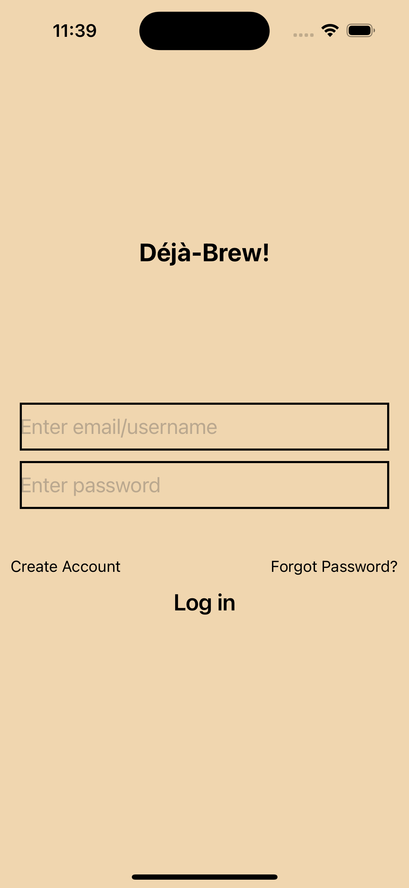
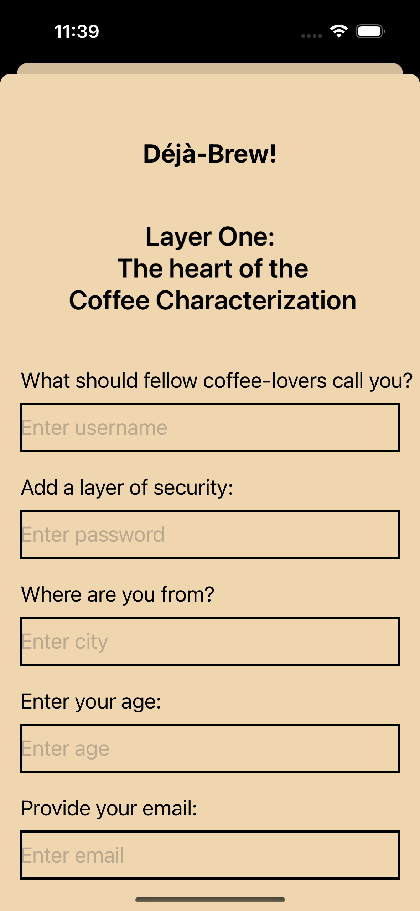
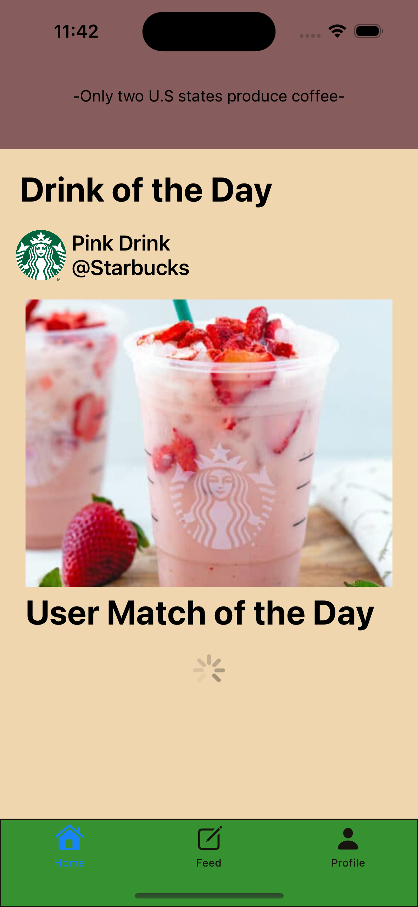
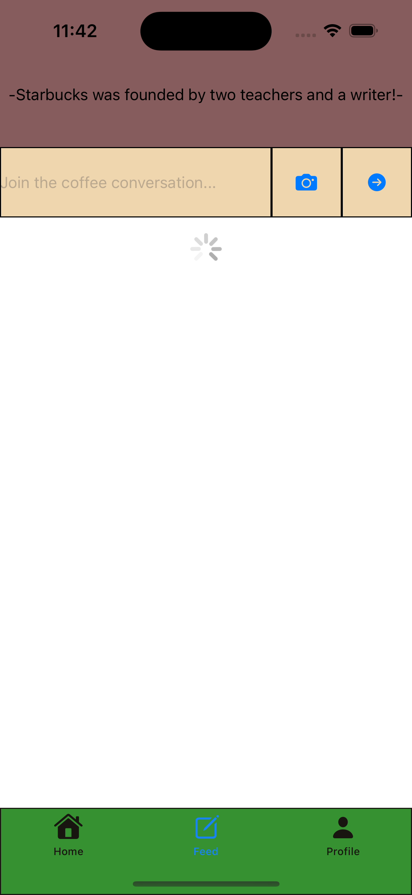
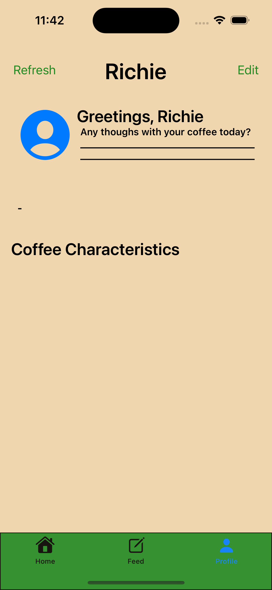

## Deja Brew

Deja-Brew is a coffee oriented social media app that allows users to connect with other coffee lovers and bond over their favorite drinks and coffee spots. The app includes a match feature, drink of the day, fun facts, coffee chat options, as well as profile changes.

Deja-Brew was coded in Programmatic Swift in UIKit, and was submitted for the SP22 hack challenge

## Screenshots

# Login and Onboarding
 

# Homepage, Feed, Profile

 
